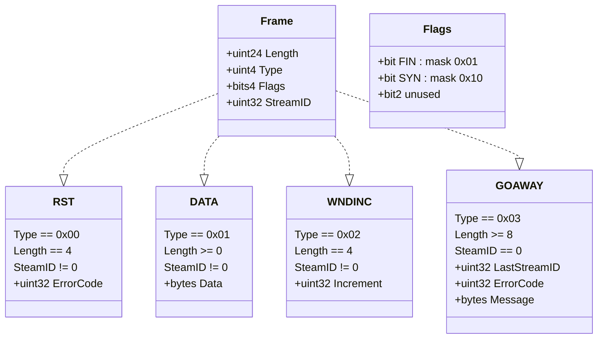

# Foreward

This is my attempt at documenting the muxado protocol after reimplementing it in
Rust using only the original Go implementation as a reference. There may be
errors, and it should not be taken as gospel if it contradicts the Go reference.

# Basic Description

Muxado is a protocol for multiplexing an arbitrary number of streams of bytes
over a single byte stream. This is most commonly used over a network connection,
such as a TCP stream, but can also be useful for local or in-memory streams. It
provides some support for backpressure in streams to ensure fairness and prevent
one noisy stream from hogging the connection. It is fully bi-directional, and
supports opening and closing streams from either end of the connection. To
coordinate these streams and send the actual stream data, muxado uses a framing
layer on top of the base connection.

If you're familiar with SPDY and HTTP/2, a lot of this should start to look
pretty familiar.

# Frame Layout

Primitive Types:
* uint\<size\>: unsigned integer \<size\>-bits long.. 
  Examples: uint32, uint8, etc.
* bits\<size\>: a bitfield consisting of \<size\> bits 
  Example: bits4
* bytes: just bytes without semantics attached. length determined elsewhere.

Integers are stored big-endian. Fields are encoded in the order listed.

# Protocol

## Session initiation

Any reliable bidirectional byte stream can be used with muxado. The
muxado-wrapped base stream is usually called a "session". There is no initial
handshake involved when starting a new muxado session. Either side may simply
begin opening streams and sending data at will.

Slight caveat: The implementation makes a distinction between the "client" side
and the "server" side. All client-initiated streams have odd-numbered IDs and
all server-initiatd streams have even-numbered IDs.

## Stream initiation

To start a new stream, either side can simply send a data frame with a new
StreamID and the SYN flag set. No acknowledgement is required from the other
end, and this initial data frame may also include actual data. Once a stream is
initiated, either side may immediately begin using it for reading and writing. 

## Reading/writing streams

After stream initiation, data frames are sent by either side with the selected
StreamID and without the SYN flag set.

As data frames are read from the muxado session, their contents is added to a
buffer allocated per-stream. As this buffer is emptied by the application,
WNDINC frames are generated and sent to the remote session to indicate that
buffer capacity has been freed, and the stream is ready to receive more data.

When writing, the muxado session should track the available per-stream buffer
capacity on the remote side as it sends data frames. This capacity is reduced as
frames are sent on the stream, and increased as WNDINC frames for the stream are
received. If there is insufficient capacity to send additional data, the session
should block until enough WNDINCs arrive.

Buffer sizing is left entirely up to the implmentation, and the protocol
provides no support for negotiating it on either session or stream initiation.
Agreement needs to be reached on proper capacity out-of-band, otherwise a writer
may exceed the reader's buffer capacity and find its stream unceremoniously
closed.

Additionally, no requirements are placed on the cadence at which WNDINC frames
are sent. Implementations may opt to send them immediately on every `read` from
the buffer with the number of bytes read, or they may elect to defer and
aggregate in order to reduce the overall number of WNDINCs sent.

## Closing streams

Either side may set the FIN flag in a data frame to indicate that it is finished
sending on a stream. This puts the stream into a half-closed state, and leaves
it still available for reading. The other side may continue sending data over
the stream until it sends a FIN-flagged data frame of its own.

If either side ever detects a stream-specific protocol error, it may send an RST
frame with the matching StreamID, along with the specific error code. These
stream-specific errors are not necessarily fatal to the overall muxado session,
and are simply an indication that the remote should stop sending on that stream.
Common error cases include a writer sending more data than the reader has
capacity for, and writes on closed/nonexistent streams. Repeated stream errors
or ignoring RSTs may be cause for entire session closure.

## Closing the session

At any time, either side may send a GOAWAY frame to indicate that the session is
closing. Once a GOAWAY is sent or received, the session is no longer usable for
either reading or writing frames. If a GOAWAY resulted from a protocol error,
its error code field should be set, optionally with a more informative message.
Additionally, the last stream that was processed should be indicated in the
LastStreamID field. This provides the other side with a hint as to which data
has successfully reached the remote application.